# Boot为启动场景
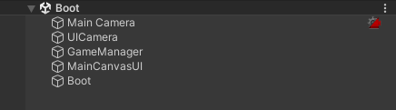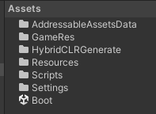
# HybridCLR
## 1.顶部菜单栏HybridCLR/Installer
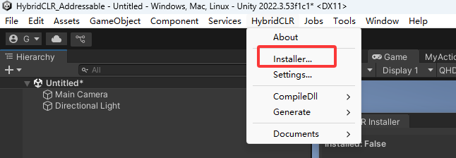
## 2.点击Install下载，等待结束
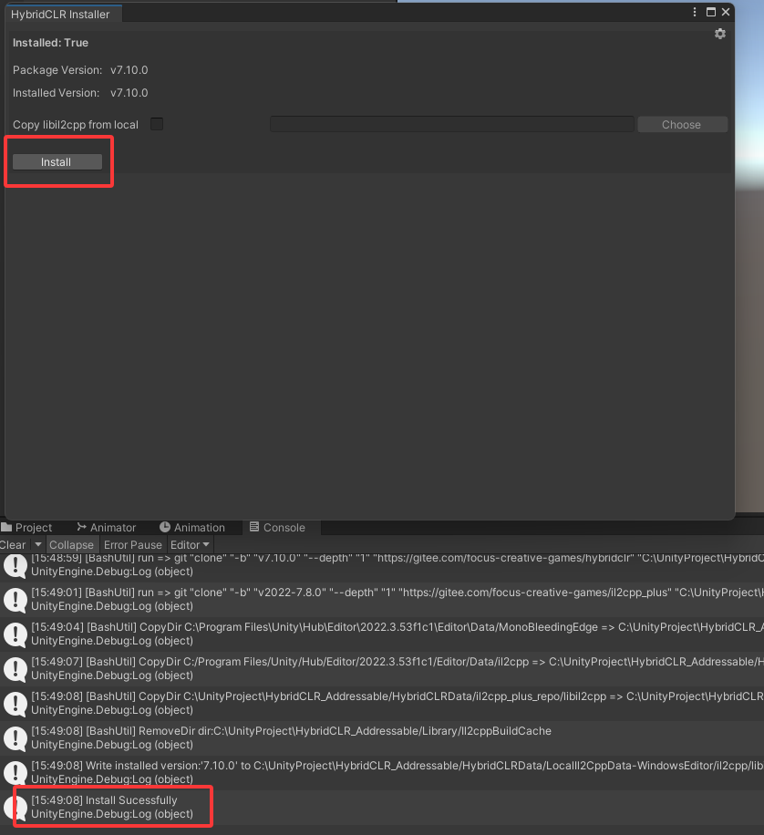
## 3.执行一次Generate/All
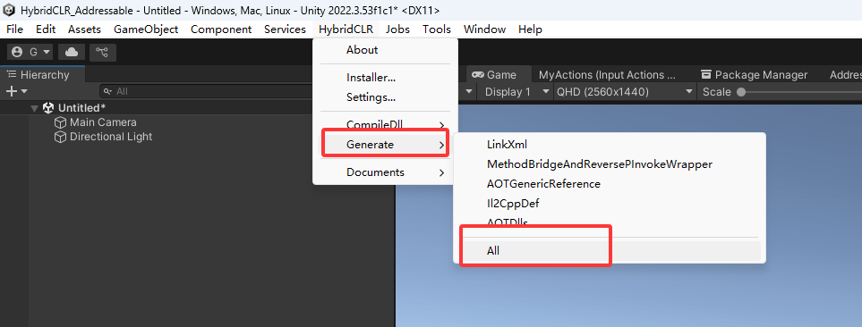
# nginx
## 1.启动nginx.exe
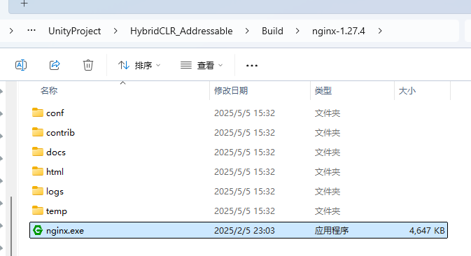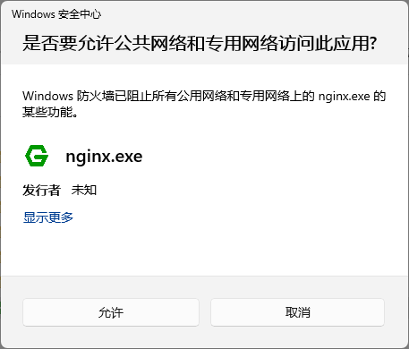
## 2.打开浏览器访问localhost:7777
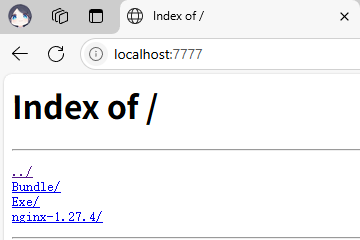
# Addressable
## 1.打包出来效果(Build/Exe/HybridCLR_Addressable.exe)
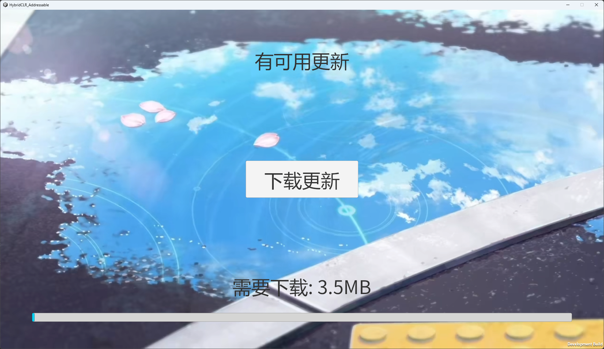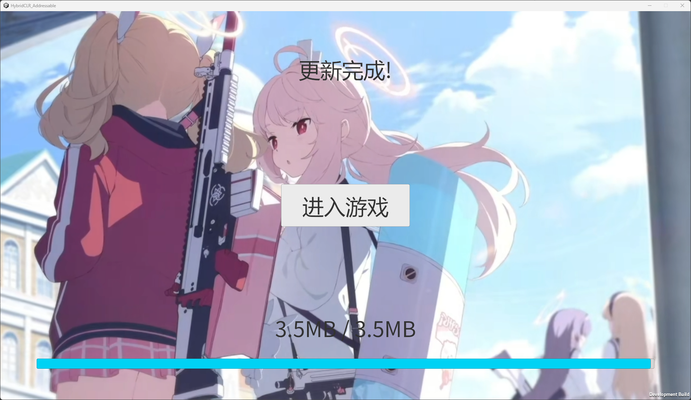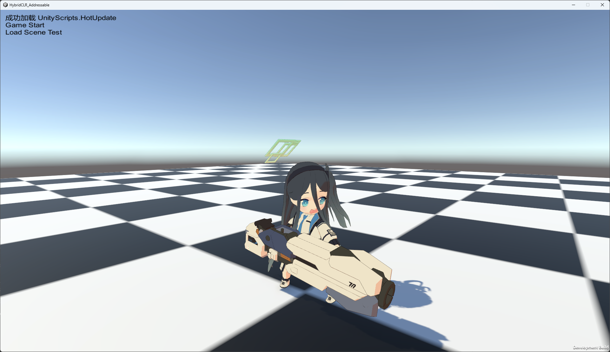
## 2.构建更新
### 设置为“preload”标签的资源再进游戏前更新，其他为按需加载
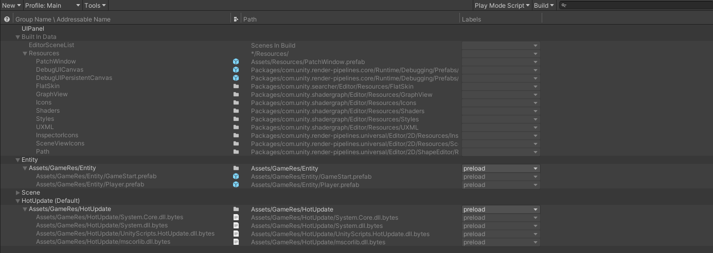
### 打包点击顶部菜单栏Tools/增量构建 或 全部重新打包
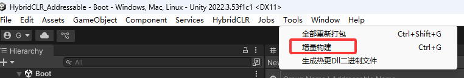
